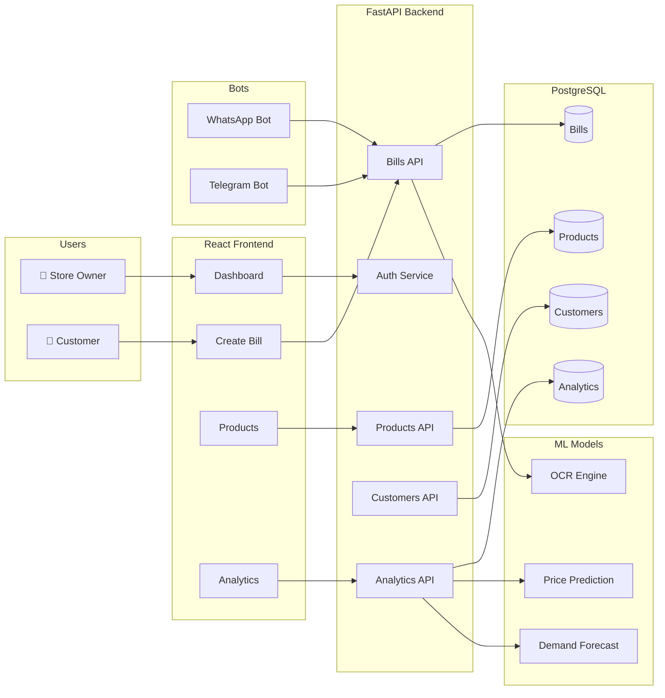
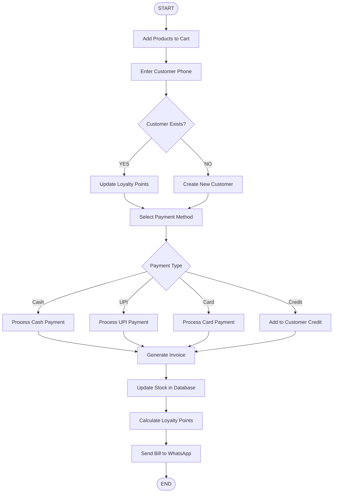
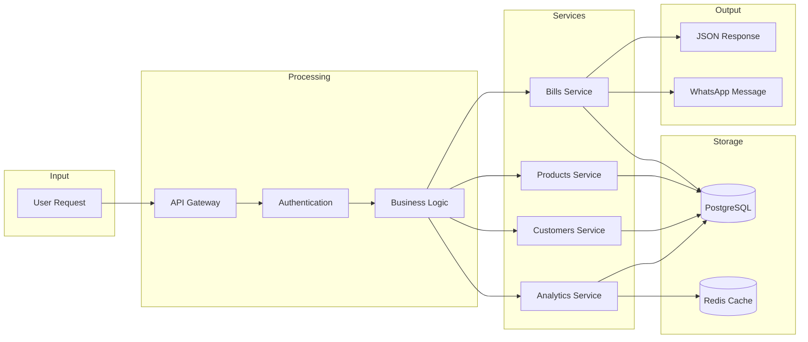
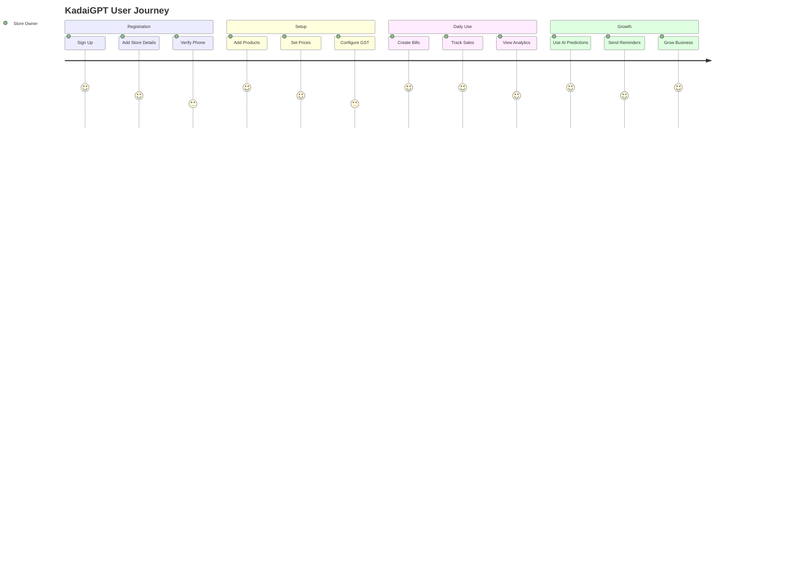
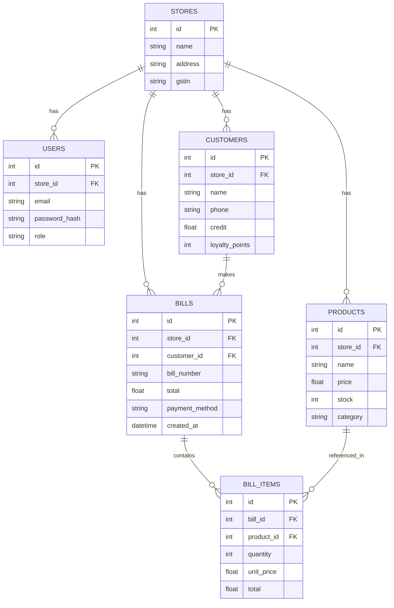

# KadaiGPT Workflow Diagrams

Use these diagrams in Mermaid Live Editor (https://mermaid.live) or draw.io to generate proper diagrams.

---

## 1. System Architecture Diagram

---

## 2. Billing Process Flowchart

---

## 3. Data Flow Diagram

---

## 4. User Journey Diagram

---

## 5. Database Schema

---

## How to Use

1. Go to https://mermaid.live
2. Paste any diagram code above
3. Export as PNG/SVG
4. Add to your PPT

Or use draw.io (https://app.diagrams.net) for more customization.
